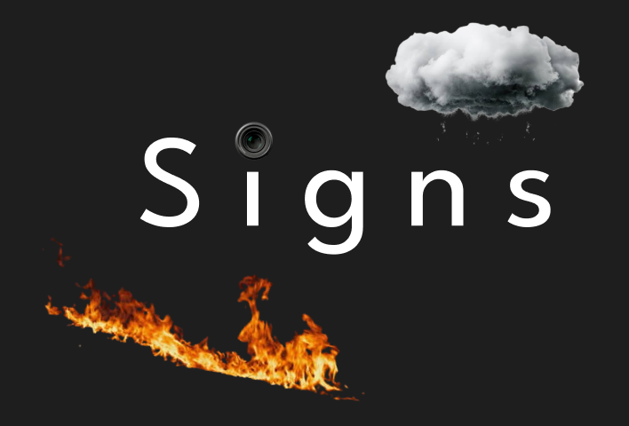
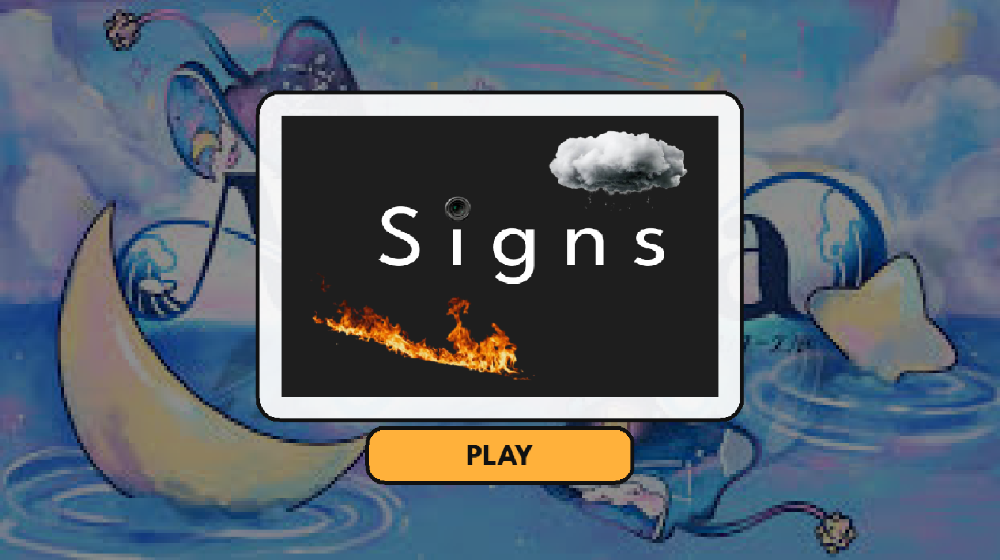
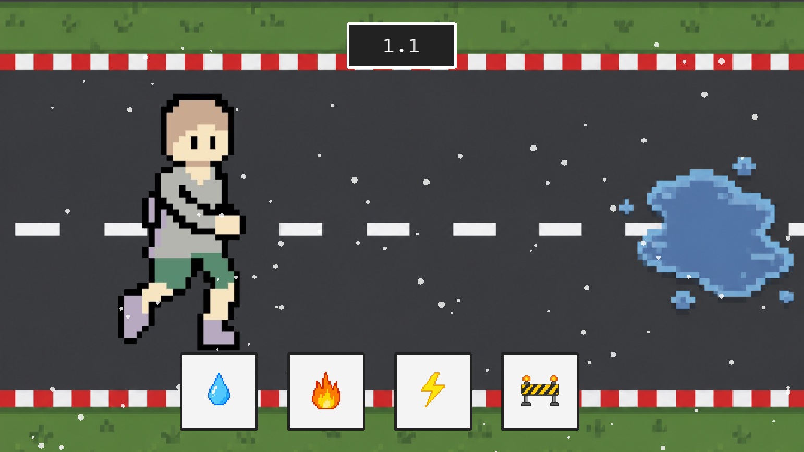

# Signs

> Signs is a roleplay simulator game, where you have to face many different emergency conditions and you must navigate through them!

  

---

# Overview

So basically, the photograph we chose was taken during Overglade, where an individual, with his camera, was capturing a "CAUTION: Slippery surface" board. Well, idk why but it struck with me and tried expressing it in the form of this web based game.

In signs, an NPC will walk his way through several dangerous and harmful "cautious" situation. Now, your job is to make sure that he reaches his destination safe and sound. With each level he survives, the game will start getting more and more difficult.

---

# Images

  

  Home Page

  

  Gameplay

---

# Acknowledgement

I would like to thank my heart out to the team and all the orgs of [Horizons | Hack Club](https://horizons.hackclub.com/app)!

